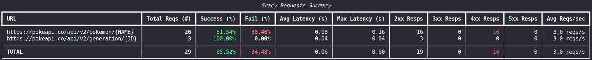

<p align="center">
    
</p>

<h2 align="center">Gracefully manage your API interactions</h2>

<p align="center">
  <!-- CI --><a href="https://github.com/guilatrova/gracy/actions"></a>
  <!-- PyPI --><a href="https://pypi.org/project/gracy/"></a>
  <!-- Supported Python versions -->
  <!-- Alternative Python versioning:  -->
  <!-- LICENSE --><a href="https://github.com/guilatrova/gracy/blob/main/LICENSE"></a>
  <!-- PyPI downloads --><a href="https://pepy.tech/project/gracy/"></a>
  <!-- Formatting --><a href="https://github.com/psf/black"></a>
  <!-- Tryceratops --><a href="https://github.com/guilatrova/tryceratops"></a>
  <!-- Typing --><a href="https://github.com/python/mypy"></a>
  <!-- Follow handle --><a href="https://twitter.com/intent/user?screen_name=guilatrova"></a>
  <!-- Sponsor --><a href="https://github.com/sponsors/guilatrova"></a>
</p>

Gracy helps you handle failures, logging, retries, throttling, and tracking for all your HTTP interactions. Gracy uses [httpx](https://github.com/encode/httpx) under the hood.

> "Let Gracy do the boring stuff while you focus on your application"

---

**Summary**

- [🧑‍💻 Get started](#-get-started)
  - [Installation](#installation)
  - [Usage](#usage)
    - [Simple example](#simple-example)
    - [More examples](#more-examples)
- [Settings](#settings)
  - [Strict/Allowed status code](#strictallowed-status-code)
  - [Parsing](#parsing)
  - [Retry](#retry)
  - [Throttling](#throttling)
  - [Logging](#logging)
  - [Custom Exceptions](#custom-exceptions)
- [Reports](#reports)
- [Advanced Usage](#advanced-usage)
  - [Customizing/Overriding configs per method](#customizingoverriding-configs-per-method)
  - [Customizing HTTPx client](#customizing-httpx-client)
- [📚 Extra Resources](#-extra-resources)
- [Change log](#change-log)
- [License](#license)
- [Credits](#credits)


## 🧑‍💻 Get started

### Installation

```
pip install gracy
```

OR

```
poetry add gracy
```

### Usage

Example will use the [PokeAPI](https://pokeapi.co).

#### Simple example

```py
# 0. Import
import asyncio
from typing import Awaitable
from gracy import BaseEndpoint, Gracy, GracyConfig, LogEvent, LogLevel

# 1. Define your endpoints
class PokeApiEndpoint(BaseEndpoint):
    GET_POKEMON = "/pokemon/{NAME}" # 👈 Put placeholders as needed

# 2. Define your Graceful API
class GracefulPokeAPI(Gracy[PokeApiEndpoint]):
    class Config:  # type: ignore
        BASE_URL = "https://pokeapi.co/api/v2/" # 👈 Optional BASE_URL
        # 👇 Define settings to apply for every request
        SETTINGS = GracyConfig(
          log_request=LogEvent(LogLevel.DEBUG),
          log_response=LogEvent(LogLevel.INFO, "{URL} took {ELAPSED}"),
          parser={
            "default": lambda r: r.json()
          }
        )

    async def get_pokemon(self, name: str) -> Awaitable[dict]:
        return await self.get(PokeApiEndpoint.GET_POKEMON, {"NAME": name})

pokeapi = GracefulPokeAPI()

async def main():
    try:
      pokemon = await pokeapi.get_pokemon("pikachu")
      print(pokemon)

    finally:
        pokeapi.report_status()


asyncio.run(main())
```

#### More examples

- [PokeAPI with retries, parsers, logs](./examples/pokeapi.py)
- [PokeAPI with throttling](./examples/pokeapi_throttle.py)

## Settings

### Strict/Allowed status code

By default Gracy considers any successful status code (200-299) as successful.

**Strict**

You can modify this behavior by defining a strict status code or increase the range of allowed status codes:

```py
from http import HTTPStatus

GracyConfig(
  strict_status_code=HTTPStatus.CREATED
)
```

or a list of values:

```py
from http import HTTPStatus

GracyConfig(
  strict_status_code={HTTPStatus.OK, HTTPStatus.CREATED}
)
```

Using `strict_status_code` means that any other code no specified will raise an error regardless of being successful or not.

**Allowed**

You can also keep the behavior, but extend the range of allowed codes.

```py
from http import HTTPStatus

GracyConfig(
  allowed_status_code=HTTPStatus.NOT_FOUND
)
```

or a list of values


```py
from http import HTTPStatus

GracyConfig(
  allowed_status_code={HTTPStatus.NOT_FOUND, HTTPStatus.FORBIDDEN}
)
```

Using `allowed_status_code` means that all successful codes plus your defined codes will be considered successful.

This is quite useful for parsing as you'll see soon.

⚠️ Note that `strict_status_code` takes precedence over `allowed_status_code`, probably you don't want to combine those. Prefer one or the other.

### Parsing

Parsing allows you to handle the request based on the status code returned.

The basic example is parsing `json`:

```py
GracyConfig(
  parser={
    "default": lambda r: r.json()
  }
)
```

In this example all successful requests will automatically return the `json()` result.

You can also narrow it down to handle specific status codes.

```py
class Config:
  GracyConfig(
    ...,
    allowed_status_code: HTTPStatusCode.NOT_FOUND,
    parser={
      "default": lambda r: r.json()
      HTTPStatusCode.NOT_FOUND: None
    }
  )

async def get_pokemon(self, name: str) -> Awaitable[dict| None]:
  # 👇 Returns either dict or None
  return await self.get(PokeApiEndpoint.GET_POKEMON, {"NAME": name})
```

Or even customize [exceptions to improve your code readability](https://guicommits.com/handling-exceptions-in-python-like-a-pro/):

```py
class PokemonNotFound(GracyUserDefinedException):
  ... # More on exceptions below

class Config:
  GracyConfig(
    ...,
    allowed_status_code: HTTPStatusCode.NOT_FOUND,
    parser={
      "default": lambda r: r.json()
      HTTPStatusCode.NOT_FOUND: PokemonNotFound
    }
  )

async def get_pokemon(self, name: str) -> Awaitable[dict]:
  # 👇 Returns either dict or raises PokemonNotFound
  return await self.get(PokeApiEndpoint.GET_POKEMON, {"NAME": name})
```

### Retry

Who doesn't hate flaky APIs? 🙋

Yet there're many of them.

Using tenacity, backoff, retry, aiohttp_retry, and any other retry libs is **NOT easy enough**. 🙅

You still would need to code the implementation for each request which is annoying.

Here's how Gracy allows you to gracefully code your retry logic:

```py
class Config:
  GracyConfig(
    retry=GracefulRetry(
      delay=1,
      max_attempts=3,
      delay_modifier=1.5,
      retry_on=None,
      log_before=None,
      log_after=LogEvent(LogLevel.WARNING),
      log_exhausted=LogEvent(LogLevel.CRITICAL),
      behavior="break",
    )
  )
```

| Parameter        | Description                                                                               | Example                                                                                                      |
| ---------------- | ----------------------------------------------------------------------------------------- | ------------------------------------------------------------------------------------------------------------ |
| `delay`          | How many seconds to wait between retries                                                  | `2` would wait 2 seconds, `1.5` would wait 1.5 seconds, and so on                                            |
| `max_attempts`   | How many times should Gracy retry the request?                                            | `10` means 1 regular request with additional 10 retries in case they keep failing. `1` should be the minimum |
| `delay_modifier` | Allows you to specify increasing delay times by multiplying this value to `delay`         | Setting `1` means no delay change. Setting `2` means delay will be doubled every retry                       |
| `retry_on`       | Should we retry for which status codes? `None` means for any non successful status code   | `HTTPStatus.BAD_REQUEST`, or `{HTTPStatus.BAD_REQUEST, HTTPStatus.FORBIDDEN}`                                |
| `log_before`     | Specify log level. `None` means don't log                                                 | More on logging later                                                                                        |
| `log_after`      | Specify log level. `None` means don't log                                                 | More on logging later                                                                                        |
| `log_exhausted`  | Specify log level. `None` means don't log                                                 | More on logging later                                                                                        |
| `behavior`       | Allows you to define how to deal if the retry fails. `pass` will accept any retry failure | `pass` or `break` (default)                                                                                  |


### Throttling

Rate limiting issues? No more.

Gracy helps you proactively deal with it before any API throws 429 in your face.

**Creating rules**

You can define rules per endpoint using regex:

```py
TWO_REQS_FOR_ANY_ENDPOINT_RULE = ThrottleRule(
  url_pattern=r".*",
  requests_per_second_limit=2
)

TEN_REQS_FOR_ANY_POKEMON_ENDPOINT_RULE = ThrottleRule(
  url_pattern=r".*\/pokemon\/.*",
  requests_per_second_limit=10
)
```

**Setting throttling**

You can set up logging and assign rules as:

```py
class Config:
  GracyConfig(
    throttling=GracefulThrottle(
        rules=ThrottleRule(r".*", 2), # 2 reqs/s for any endpoint
        log_limit_reached=LogEvent(LogLevel.ERROR),
        log_wait_over=LogEvent(LogLevel.WARNING),
    ),
  )
```

### Logging

You can **define and customize logs** for events by using `LogEvent` and `LogLevel`:

```py
verbose_log = LogEvent(LogLevel.CRITICAL)
custom_warn_log = LogEvent(LogLevel.WARNING. custom_message="{METHOD} {URL} is quite slow and flaky")
custom_error_log = LogEvent(LogLevel.INFO, custom_message="{URL} returned a bad status code {STATUS}, but that's fine")
```

Note that placeholders are formatted and replaced later on by Gracy based on the event type, like:

**Placeholders per event**

| Placeholder        | Description                                                                     | Example                                 | Supported Events                                                                                                                                                                                                                                |
| ------------------ | ------------------------------------------------------------------------------- | --------------------------------------- | ----------------------------------------------------------------------------------------------------------------------------------------------------------------------------------------------------------------------------------------------- |
| `{URL}`            | Endpoint being targetted. Sometimes formatted, sometimes containg placeholders. | `/pokemon/{NAME}`, `/pokemon/{PIKACHU}` | <ul><li>[x] Before request</li><li>[x] After response</li><li>[x] Response error</li><li>[x] Before retry</li><li>[x] After retry</li><li>[x] Retry exhausted</li><li>[x] Throttle limit reached</li><li>[x] Throttle limit available</li></ul> |
| `{METHOD}`         | HTTP Request being used                                                         | `GET`, `POST`                           | <ul><li>[x] Before request</li><li>[x] After response</li><li>[x] Response error</li><li>[ ] Before retry</li><li>[ ] After retry</li><li>[ ] Retry exhausted</li><li>[ ] Throttle limit reached</li><li>[ ] Throttle limit available</li></ul> |
| `{STATUS}`         | Status code returned by the response                                            | `200`, `404`, `501`                     | <ul><li>[ ] Before request</li><li>[x] After response</li><li>[x] Response error</li><li>[ ] Before retry</li><li>[ ] After retry</li><li>[ ] Retry exhausted</li><li>[ ] Throttle limit reached</li><li>[ ] Throttle limit available</li></ul> |
| `{ELAPSED}`        | Amount of seconds taken for the request to complete                             | *Numeric*                               | <ul><li>[ ] Before request</li><li>[x] After response</li><li>[x] Response error</li><li>[ ] Before retry</li><li>[ ] After retry</li><li>[ ] Retry exhausted</li><li>[ ] Throttle limit reached</li><li>[ ] Throttle limit available</li></ul> |
| `{RETRY_DELAY}`    | How long Gracy will wait before repeating the request                           | *Numeric*                               | *Any Retry event*                                                                                                                                                                                                                               |
| `{CUR_ATTEMPT}`    | Current attempt count for the current request                                   | *Numeric*                               | *Any Retry event*                                                                                                                                                                                                                               |
| `{MAX_ATTEMPT}`    | Max attempt defined for the current request                                     | *Numeric*                               | *Any Retry event*                                                                                                                                                                                                                               |
| `{THROTTLE_LIMIT}` | How many reqs/s is defined for the current request                              | *Numeric*                               | *Any Throttle event*                                                                                                                                                                                                                            |
| `{THROTTLE_TIME}`  | How long Gracy will wait before calling the request                             | *Numeric*                               | *Any Throttle event*                                                                                                                                                                                                                            |

and you can set up the log events as follows:

**Requests**

1. Before request
2. After response
3. Response has non successful errors

```py
GracyConfig(
  log_request=LogEvent(),
  log_response=LogEvent(),
  log_errors=LogEvent(),
)
```

**Retry**

1. Before retry
2. After retry
3. When retry exhausted

```py
GracefulRetry(
  ...,
  log_before=LogEvent(),
  log_after=LogEvent(),
  log_exhausted=LogEvent(),
)
```

**Throttling**

1. When reqs/s limit is reached
2. When limit decreases again

```py
GracefulThrottle(
  ...,
  log_limit_reached=LogEvent()
  log_wait_over=LogEvent()
)
```

### Custom Exceptions

You can define custom exceptions for more [fine grained control over your exception messages/types](https://guicommits.com/how-to-structure-exception-in-python-like-a-pro/).

The simplest you can do is:

```py
from gracy import Gracy, GracyConfig
from gracy.exceptions import GracyUserDefinedException

class MyCustomException(GracyUserDefinedException):
  pass

class MyApi(Gracy[str]):
  class Config:
    SETTINGS = GracyConfig(
      ...,
      parser={
        HTTPStatus.BAD_REQUEST: MyCustomException
      }
    )
```

This will raise your custom exception under the conditions defined in your parser.

```py
class PokemonNotFound(GracyUserDefinedException):
    BASE_MESSAGE = "Unable to find a pokemon with the name [{NAME}] at {URL} due to {STATUS} status"

    def _format_message(self, base_endpoint: str, endpoint_args: dict[str, str], response: httpx.Response) -> str:
        format_args = self._build_default_args()
        name = endpoint_args.get("NAME", "Unknown")
        return self.BASE_MESSAGE.format(NAME=name, **format_args)

```

## Reports

Generate [Rich](https://github.com/Textualize/rich) reports and find out:

- Your API success/fail rate
- Average latency
- Slowest endpoints
- Times an endpoint got hit
- Status group returned

```py
class GracefulPokeAPI(Gracy[PokeApiEndpoint]):
  ...

pokeapi = GracefulPokeAPI()
# do stuff with your API
pokeapi.report_status()
```

Here's an example of how it looks:



## Advanced Usage

### Customizing/Overriding configs per method

APIs may return different responses/conditions/payloads based on the endpoint.

You can override any `GracyConfig` on a per method basis by using the `graceful` decorator.

```python
from gracy import Gracy, GracyConfig, GracefulRetry, graceful

retry = GracefulRetry(...)

class GracefulPokeAPI(Gracy[PokeApiEndpoint]):
    class Config:  # type: ignore
        BASE_URL = "https://pokeapi.co/api/v2/"
        SETTINGS = GracyConfig(
            retry=retry,
            log_errors=LogEvent(
                LogLevel.ERROR, "How can I become a master pokemon if {URL} keeps failing with {STATUS}"
            ),
        )

    @graceful(
        retry=None, # Disables retry set in Config
        log_errors=None, # Disables log_errors set in Config
        allowed_status_code=HTTPStatus.NOT_FOUND,
        parser={
            "default": lambda r: r.json()["order"],
            HTTPStatus.NOT_FOUND: None,
        },
    )
    async def maybe_get_pokemon_order(self, name: str):
        val: str | None = await self.get(PokeApiEndpoint.GET_POKEMON, {"NAME": name})
        return val

    @graceful( # Retry and log_errors are still set for this one
      strict_status_code=HTTPStatus.OK,
      parser={"default": lambda r: r.json()["order"]},
    )
    async def get_pokemon_order(self, name: str):
      val: str = await self.get(PokeApiEndpoint.GET_POKEMON, {"NAME": name})
      return val
```

### Customizing HTTPx client

You might want to modify the HTTPx client settings, do so by:

```py
class YourAPIClient(Gracy[str]):
    class Config:  # type: ignore
        ...

    def __init__(self, token: token) -> None:
        self._token = token
        super().__init__()

    # 👇 Implement your logic here
    def _create_client(self) -> httpx.AsyncClient:
        client = super()._create_client()
        client.headers = {"Authorization": f"token {self._token}"}  # type: ignore
        return client
```

## 📚 Extra Resources

Some good practices I learned over the past years guided Gracy's philosophy, you might benefit by reading:

- [How to log](https://guicommits.com/how-to-log-in-python-like-a-pro/)
- [How to handle exceptions](https://guicommits.com/handling-exceptions-in-python-like-a-pro/)
  - [How to structure exceptions](https://guicommits.com/how-to-structure-exception-in-python-like-a-pro/)
- [How to use Async correctly](https://guicommits.com/effective-python-async-like-a-pro/)
- [Book: Python like a PRO](https://guilatrova.gumroad.com/l/python-like-a-pro)
- [Book: Effective Python](https://amzn.to/3bEVHpG)

<!-- ## Contributing -->
<!-- Thank you for considering making Gracy better for everyone! -->
<!-- Refer to [Contributing docs](docs/CONTRIBUTING.md).-->

## Change log

See [CHANGELOG](CHANGELOG.md).

## License

MIT

## Credits

Thanks to the last three startups I worked which forced me to do the same things and resolve the same problems over and over again. I got sick of it and built this lib.

Most importantly: **Thanks to God**, who allowed me (a random 🇧🇷 guy) to work for many different 🇺🇸 startups. This is ironic since due to God's grace, I was able to build Gracy. 🙌

Also, thanks to the [httpx](https://github.com/encode/httpx) and [rich](https://github.com/Textualize/rich) projects for the beautiful and simple APIs that powers Gracy.
